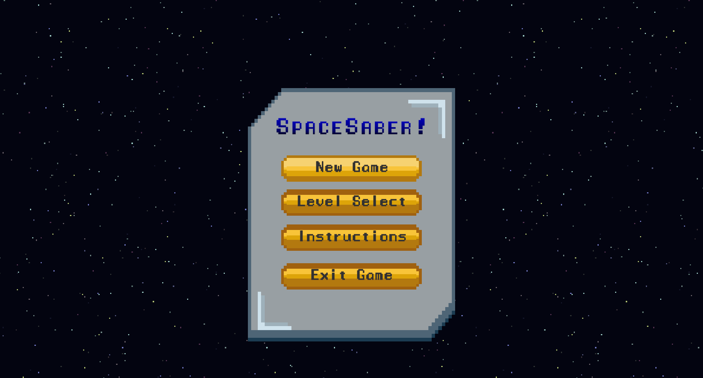
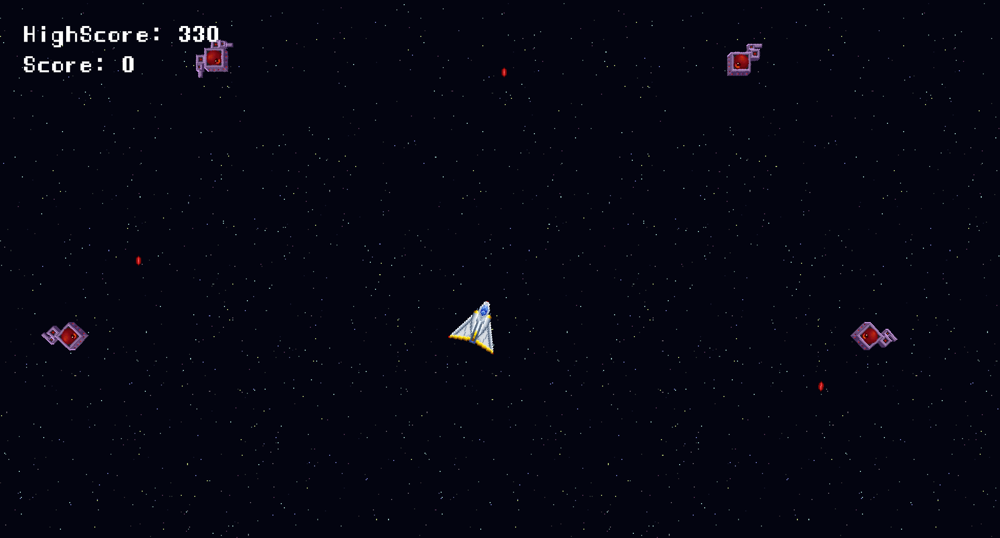
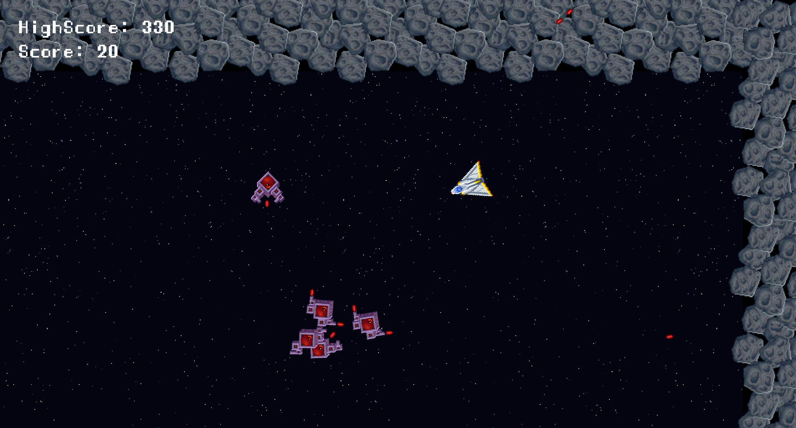
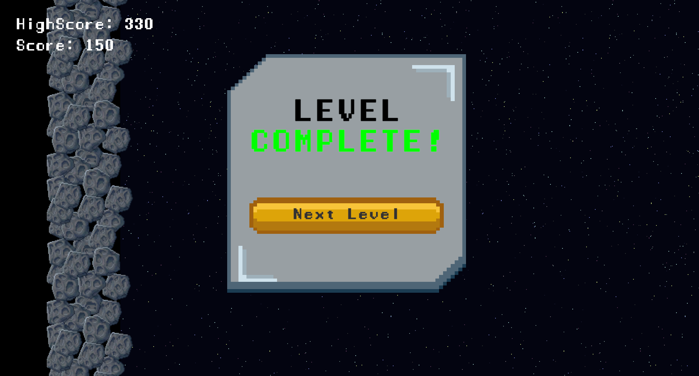

# 🚀 SpaceSaber

**SpaceSaber** is a fast-paced 2D space shooter game built in Unity. Battle through waves of enemies with reflex-based combat, rich soundscapes, and evolving difficulty.

---

## 🕹️ Controls

- **W / A / S / D** — Move your spaceship
- **Mouse (Left Click)** — Fire weapon
- **Spacebar** — Pause / Unpause game

---

## 🎮 Play Now

👉 [Play SpaceSaber on Itch.io](https://abhisheksbiju.itch.io/spacesaber)

---

## 🌌 Features

- 🔫 **3 fully playable levels**, with more in development
- 🤖 **6 enemy bot types**:
  - 3 of them are **cursor-sensitive** — they track the player's position and move toward it
- 🎧 **Unique background music** for:
  - Each level
  - Main menu
- 🛰️ Fast-paced bullet-dodging and aiming gameplay
- 💥 Mouse-based shooting for precision combat

---

## 📸 Screenshots

## 📸 Screenshots

### 🔹 Main Menu  

### 🔹 IN - GAME 
  

---

## 🚧 In Development

- ✅ Boss fights
- ✅ New power-ups
- ✅ More enemy types and level-specific mechanics
- ✅ UI polish and visual effects

---

## 🛠 Built With

- Unity (2D)
- C#
- Custom-made enemy Bots and pathfinding
- Sound effects & background music integrated for atmosphere

---

## 📂 Project Structure

- **Library** ( Not included in Github , size concerned )
- **Assets** ( Not included in GitHub , Size concerned -- **But added the scripts Folder** )
- **Packages** ( Not included in GitHub , size oncerned )
- **ProjectSettings** ( Not included int GitHub )
- **Build** ( Included in README.md )
- **ScreenShots** ( Not included in GitHub )
- **.gitignore**
- **LICENSE**
- **README.md**

--- 

